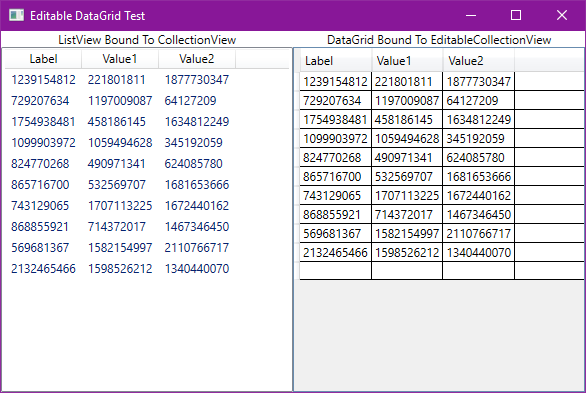

# Swordfish.NET.CollectionsV3

Swordfish.NET.CollectionsV3 is a library that provides Concurrent, Observable collections.


[](https://www.nuget.org/packages/Swordfish.NET.CollectionsV3)


# Contents

- [Collection Types](#collection-types)
- [Usage (CollectionView)](#usage-collectionview)
- [Usage (EditableCollectionView) - v3.3.0 onwards](#usage-editablecollectionview---v330-onwards)

# Collection Types

The primary collection types that are available are:

- ConcurrentObservableCollection
- ConcurrentObservableDictionary
- CuncurrentObservableHashSet
- ConcurrentObservableSortedCollection
- ConcurrentObservableSortedDictionary
- ConcurrentObservableSortedSet

There's also some other collection and utility classes included, but they aren't the focus, and I haven't documented
them yet.

> 
> *Notes on version 2*
> 
> The original Swordfish.NET.Collections (Versioned at 2.x) is included in this repository for historical reasons.
> You should be using the Swordfish.NET.CollectionsV3 version. I've kept the original version as
> some people like it because it is a direct replacement for ObservableCollection. However the
> Version 2.x is non-performant, and it is possible to cause this version to
> get the view out of sync with the underlying collection which is catastrophic, although 
> I haven't been able to reproduce this issue as it's only been reported once. Version 3 certainly
> shouldn't have any sync issues like this as the mechanism it uses is much more robust.


# Usage (CollectionView)

Use these collections as you would any other collection class. The difference is that you can add and
remove items from these classes from multiple threads at once while having the collection bound to a
ListBox, ListView, DataGrid or other control that displays a collection. The following code is from the
[EditableDataGridTest example](ExamplesAndTests/EditableDataGridTest) found in this repo.

The example uses this view model:

```CSharp
/// <summary>
/// View model used as a source of items for both a ListView and a DataGrid
/// </summary>
public class DataGridTestViewModel
{
    private Random _random = new Random();
    public DataGridTestViewModel()
    {
        var randomItems = Enumerable.Range(0, 10).Select(i => new TestItem
        {
            Label = _random.Next().ToString(),
            Value1 = _random.Next().ToString(),
            Value2 = _random.Next().ToString()
        });
        DataGridTestCollection.AddRange(randomItems);
    }
    /// <summary>
    /// The source collection
    /// </summary>
    public ConcurrentObservableCollection<TestItem> DataGridTestCollection { get; }
        = new ConcurrentObservableCollection<TestItem>();
}
```

`TestItem` is just a class with 3 properties that implements `INotifyPropertyChanged`

Here's the really important bit, to bind to the collection in a `ListView` **you must bind
to the collection and the CollectionView property**. It's important to have the 2 properties in the
binding, as the CollectionView property changes every time the collection is modified. The collection
returned by the CollectionView property getter is immutable, it never changes, so you need a new
immutable collection every time an item is added, removed or moved. The items themselves though
can be mutable. So `ListView` needs to know that it has to listen to the `PropertyChanged` event
on the collection. Here's the code, which hopefully makes it clear:

```xml
<!-- ListView binds to TestCollection.CollectionView -->
<ListView ItemsSource="{Binding TestCollection.CollectionView}" Grid.Row="1" Grid.Column="0" >
    <ListView.View>
        <GridView>
            <GridView.Columns>
                <GridViewColumn Header="Label" DisplayMemberBinding="{Binding Label}"/>
                <GridViewColumn Header="Value1" DisplayMemberBinding="{Binding Value1}"/>
                <GridViewColumn Header="Value2" DisplayMemberBinding="{Binding Value2}"/>
            </GridView.Columns>
        </GridView>
    </ListView.View>
</ListView>
```

For the above xaml you would have a view model that looks like this:

```csharp
public class ExampleViewModel : INotifyPropertyChanged
{
    public ConcurrentObservableCollection<TestItem> TestCollection { get; }
        = new ConcurrentObservableCollection<TestItem>();

    public event PropertyChangedEventHandler PropertyChanged;
}
```

There is an alternative way to bind to the collection. In your view model you
subscribe to the `PropertyChanged` event of the collections you are using,
and you pass the CollectionView through another property in your view model.
Here's and example of a view model that does this:
```csharp
public class ExampleViewModel : INotifyPropertyChanged
{
    public ExampleViewModel()
    {
        TestCollection.PropertyChanged += (s, e) =>
        {
            switch (e.PropertyName)
            {
                case nameof(ConcurrentObservableCollection<TestItem>.CollectionView):
                    PropertyChanged?.Invoke(this,
                        new PropertyChangedEventArgs(nameof(TestCollectionView)));
                    break;
            }
        };
    }

    public ConcurrentObservableCollection<TestItem> TestCollection { get; }
        = new ConcurrentObservableCollection<TestItem>();

    public IList<TestItem> TestCollectionView => TestCollection.CollectionView;

    public event PropertyChangedEventHandler PropertyChanged;
}

```

# Usage (EditableCollectionView) - v3.3.0 onwards

The `EditableCollectionView` property is new for version 3.3.0 and is only on
ConcurrentObservableCollection, I will add it to other collections if there is any
demand for it. This property is almost the same as CollectionView except the
returned collection is mutable. I could have just added this functionality to the
object returned from CollectionView, however the object that is returned from EditableCollectionView
is a different type to what is returned from the CollectionView property, and that might have
broken somebody's code somwehere, so I opted to add a new property rather than make a
potential breaking change. Under the covers it is a wrapper that reads
items from the immutable collection returned from the CollectionView property, but
passes addition and removal of items back to the host ConcurrentObservableCollection,
and replaces the internal immutable collection in the wrapper with a new one when
an add or remove item is done through the binding. You can see how this works in
the source file
[EditableImmutableListBridge.cs](Swordfish.NET.CollectionsV3/EditableBridges/EditableImmutableListBridge.cs).

Below is how you use the ```EditableCollectionView``` property. The same rules
apply as when you use the [CollectionView](#usage-collection-view) property. Again
this is from the [EditableDataGridTest example](ExamplesAndTests/EditableDataGridTest)
found in this repo.

```xml
<!-- DataGrid binds to TestCollection.EditableCollectionView -->
<DataGrid ItemsSource="{Binding TestCollection.EditableCollectionView}" AutoGenerateColumns="True" Grid.Row="1" Grid.Column="1" />
```

For the xaml above you would have a view model that looks like this:
```csharp
public class ExampleViewModel
{
    public ExampleViewModel()
    {
    }

    public ConcurrentObservableCollection<TestItem> TestCollection { get; }
        = new ConcurrentObservableCollection<TestItem>();
}
```

Alternatively, same as for binding to CollectionView (see previous section), you listen
to the `PropertyChanged` event on the collection and have a proxy for the `EditableCollectionView`
property like the example below, which includes proxies for `CollectionView` and `EditableCollectionView`

```csharp
public class ExampleViewModel : INotifyPropertyChanged
{
    public ExampleViewModel()
    {
        TestCollection.PropertyChanged += (s, e) =>
        {
            switch (e.PropertyName)
            {
                case nameof(ConcurrentObservableCollection<TestItem>.CollectionView):
                    PropertyChanged?.Invoke(this, new PropertyChangedEventArgs(nameof(TestCollectionView)));
                    break;
                case nameof(ConcurrentObservableCollection<TestItem>.EditableCollectionView):
                    PropertyChanged?.Invoke(this, new PropertyChangedEventArgs(nameof(EditableTestCollectionView)));
                    break;
            }
        };
    }

    public ConcurrentObservableCollection<TestItem> TestCollection { get; }
        = new ConcurrentObservableCollection<TestItem>();

    public IList<TestItem> TestCollectionView => TestCollection.CollectionView;
    public IList<TestItem> EditableTestCollectionView => TestCollection.EditableCollectionView;

    public event PropertyChangedEventHandler PropertyChanged;
}

```

For the above view model your xaml could look something like this:

```xml

<!-- ListView binds to TestCollection.CollectionView -->
<ListView ItemsSource="{Binding TestCollectionView}" Grid.Row="1" Grid.Column="0" >
    <ListView.View>
        <GridView>
            <GridView.Columns>
                <GridViewColumn Header="Label" DisplayMemberBinding="{Binding Label}"/>
                <GridViewColumn Header="Value1" DisplayMemberBinding="{Binding Value1}"/>
                <GridViewColumn Header="Value2" DisplayMemberBinding="{Binding Value2}"/>
            </GridView.Columns>
        </GridView>
    </ListView.View>
</ListView>

<!-- DataGrid binds to TestCollection.EditableCollectionView -->
<DataGrid ItemsSource="{Binding EditableTestCollectionView}" AutoGenerateColumns="True" Grid.Row="1" Grid.Column="1" />
```

Below is a screenshot of the EditableDataGridTest example running, on the right is
the DataGrid control with the dummy row being displayed indicating a new item can be
added to the collection from the DataGrid control.


